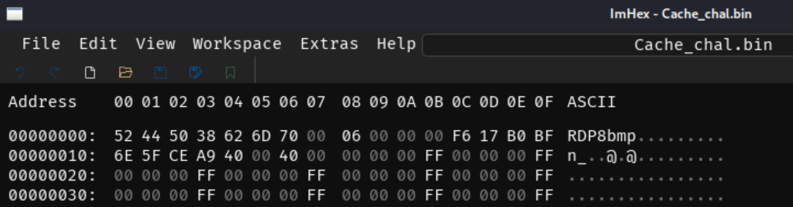

# Wani CTF 2024

## Forensics

### tiny\_usb \[116]

What a small usb!

**Solution:**

Just extract the .iso file.


```bash
$ file chal_tiny_usb.iso 
chal_tiny_usb.iso: ISO 9660 CD-ROM filesystem data 'CHAL_TINY_USB'

$ binwalk -e chal_tiny_usb.iso

$ tree .
.
├── _chal_tiny_usb.iso.extracted
│   ├── 0.iso
│   └── iso-root
│       └── FLAG.PNG
└── chal_tiny_usb.iso
```


<figure><figcaption><p>FLAG.PNG</p></figcaption></figure>

<details>

<summary>FLAG 👇</summary>

FLAG{hey\_i\_just\_bought\_a\_usb}

</details>

### Surveillance\_of\_sus \[126]

A PC is showing suspicious activity, possibly controlled by a malicious individual.

It seems a cache file from this PC has been retrieved. Please investigate it!

**Solution:**

First, I checked the file type by examining the file signature.

<figure><figcaption><p>RDP Bitmap</p></figcaption></figure>

It was identified as an RDP Bitmap Cache. So, I used the parser from [https://github.com/ANSSI-FR/bmc-tools](https://github.com/ANSSI-FR/bmc-tools).


```bash
$ python bmc-tools.py -s Cache_chal.bin -d .
[+++] Processing a single file: 'Cache_chal.bin'.
[===] 650 tiles successfully extracted in the end.
[===] Successfully exported 650 files.
```


<figure><figcaption></figcaption></figure>

<details>

<summary>FLAG 👇</summary>

FLAG{RDP\_is\_useful\_yipeee}

</details>

### codebreaker \[140]

I, the codebreaker, have broken the QR code!

**Solution:**

**Given the damaged QR code.**

<figure><figcaption><p>challenge attachment</p></figcaption></figure>

To repair this QR code, we should understand its structure.

<figure><figcaption><p><a href="https://upload.wikimedia.org/wikipedia/commons/7/7a/QR_Code_Structure_Example.svg">https://upload.wikimedia.org/wikipedia/commons/7/7a/QR_Code_Structure_Example.svg</a></p></figcaption></figure>

First, I recovered the position pattern.

<div align="left">

<figure><figcaption></figcaption></figure>

</div>

Then, i used [https://merri.cx/qrazybox/](https://merri.cx/qrazybox/) as recovery toolkit. When I loaded the image above, it said the Version pattern was damaged.&#x20;

Finally, my teammate successfully recovered the QR code.

<div align="left">

<figure><figcaption><p>Fixed QR Code</p></figcaption></figure>

</div>

<details>

<summary>FLAG 👇</summary>

FLAG{How\_scan-dalous}

</details>

### I\_wanna\_be\_a\_streamer \[169]

Sorry Mom, I'll work as a streamer. Watch my stream once in a while. (H.264 is used for video encoding.)

**Solution:**

<figure><figcaption></figcaption></figure>

There are a lot of RTP protocols with type-96. I suspect the video streams are using this type.  Searching for "H.264" on GitHub, I found [https://github.com/volvet/h264extractor](https://github.com/volvet/h264extractor).&#x20;

So, we will install the .LUA file as plugins.&#x20;

1. Find the plugins folder (Menu > Help > About Wireshark > Folders)
2. Paste the [rtp\_h264\_extractor.lua](https://github.com/volvet/h264extractor/blob/master/rtp\_h264\_extractor.lua) into this folder
3. Reload plugins (Menu > Analyze > Reload Lua Plugins)
4. Update the H.264 payload type on Wireshark (Edit > Preferences > Protocols > H.264 > type 96)
5. Filter for "h264"
6. Go to Menu > Tools > Extract h264 stream from RTP
7. Find the output file and play the video!

<figure><figcaption><p>Extract H.264 from RTP</p></figcaption></figure>

```
$ ffplay video_20240623-183910.264 
ffplay version 6.1.1-4+b3 Copyright (c) 2003-2023 the FFmpeg developers
  built with gcc 13 (Debian 13.2.0-25)
Input #0, h264, from 'video_20240623-183910.264': sq=    0B f=0/0   
  Duration: N/A, bitrate: N/A
  Stream #0:0: Video: h264 (Main), yuvj420p(pc, progressive), 1920x1080 [SAR 1:1 DAR 16:9], 25 fps, 60 tbr, 1200k tbn
```

<figure><figcaption></figcaption></figure>

<details>

<summary>FLAG 👇</summary>

FLAG{Th4nk\_y0u\_f0r\_W4tching}

</details>

### tiny\_10px \[180]

What a small world!

<figure><figcaption><p>Given attachment</p></figcaption></figure>

**Solution:**

This chall is about image dimensions.

```bash
$ exiftool chal_tiny_10px.jpg
File Name                       : chal_tiny_10px.jpg
Directory                       : .
Displayed Units X               : inches
Displayed Units Y               : inches
Image Width                     : 10
Image Height                    : 10
Encoding Process                : Baseline DCT, Huffman coding
Bits Per Sample                 : 8
Color Components                : 3
Y Cb Cr Sub Sampling            : YCbCr4:4:4 (1 1)
Image Size                      : 10x10
Megapixels                      : 0.000100
```

We should understand the jpeg structure first, [https://en.wikipedia.org/wiki/JPEG](https://en.wikipedia.org/wiki/JPEG) and this is my reference for this chall [https://hackmd.io/@XeusNguyen/S1DdU66Zo](https://hackmd.io/@XeusNguyen/S1DdU66Zo).

<figure><figcaption><p>JPEG Markers</p></figcaption></figure>

<figure><figcaption><p><a href="https://cyberhacktics.com/content/images/2020/12/hex.png">https://cyberhacktics.com/content/images/2020/12/hex.png</a></p></figcaption></figure>

The height and width bytes starts with 0xFF 0xC0.&#x20;

<figure><figcaption><p>SOF marker</p></figcaption></figure>

I found these bytes at offset 0xD90. Long story short, I chose a height of 75px because a new part of the image appeared. Next, I brute-forced the width to find the best picture.


```python
def read_jpg_height_and_width(filename, offset):
    with open(filename, 'rb') as f:
        f.seek(offset)
        data = f.read(4)
        height, width = int.from_bytes(data[:2], 'big'), int.from_bytes(data[2:], 'big')
    return height, width

def write_jpg_height_and_width(original_filename, new_filename, offset, height, width):
    with open(original_filename, 'rb') as original_file:
        with open(new_filename, 'wb') as new_file:
            # Copy the original file contents to the new file
            new_file.write(original_file.read())

            # Modify the new file at the specified offset
            new_file.seek(offset)
            data = height.to_bytes(2, 'big') + width.to_bytes(2, 'big')
            new_file.write(data)

jpeg_file = 'chal_tiny_10px.jpg'
offset = 0xD90
new_height = 75

# Read the original height and width
original_height, original_width = read_jpg_height_and_width(jpeg_file, offset)
print(f"Original height: {original_height}, Original Width: {original_width}")


for new_width in range(original_width, new_height * 8):
    new_jpeg_file = "new_" + str(new_width) + ".jpg"
    # Write the new height and width to a new file
    write_jpg_height_and_width(jpeg_file, new_jpeg_file, offset, new_height, new_width)

    # Read the modified height and width from the new file to verify changes
    modified_height, modified_width = read_jpg_height_and_width(new_jpeg_file, offset)
    print(f"Modified height: {modified_height}, Modified Width: {modified_width}")
```


I got the best image with size of 320x75 px.

<figure><figcaption><p>Image Size : 320x75 px</p></figcaption></figure>

<details>

<summary>FLAG 👇</summary>

FLAG{b1g\_en0ugh}

</details>

### mem\_search \[185]

I found an unknown file, and upon opening it, it caused some strange behavior, so I took a memory dump!

How was the attack carried out?

The memory dump is large, and you can download it from the following URL (it will be 2GB when extracted).

Please note that the file may become unavailable after the WaniCTF event.

https://drive.google.com/file/d/1sxnYz-bp-E9Bj9usN8lRoL4OE8AxrCRu/view?usp=sharing

Note: There are two flags in the file. The flag that starts with FLAG{H is not the correct answer. Please submit the flag that starts with FLAG{D.

**Solution:**


```bash
$ file chal_mem_search.DUMP 
chal_mem_search.DUMP: MS Windows 64bit crash dump, version 15.19041, 1 processors, full dump, 4992030524978970960 pages
```


This is a volatile memory dump of a Windows system.

```bash
$ python vol.py -f chal_mem_search.DUMP windows.pslist
Volatility 3 Framework 2.7.1
Progress:  100.00               PDB scanning finished                                
PID     PPID    ImageFileName   Offset(V)       Threads Handles SessionId       Wow64   CreateTime      ExitTime        File output

4       0       System  0xcd88c7a97040  168     -       N/A     False   2024-05-11 09:31:11.000000      N/A     Disabled
72      4       Registry        0xcd88c7a85080  4       -       N/A     False   2024-05-11 09:31:06.000000      N/A     Disabled
528     4       smss.exe        0xcd88c9ac8040  2       -       N/A     False   2024-05-11 09:31:11.000000      N/A     Disabled
632     624     csrss.exe       0xcd88c946a080  10      -       0       False   2024-05-11 09:31:13.000000      N/A     Disabled
704     624     wininit.exe     0xcd88cb7d1080  1       -       0       False   2024-05-11 09:31:13.000000      N/A     Disabled
712     696     csrss.exe       0xcd88cb7d9140  11      -       1       False   2024-05-11 09:31:13.000000      N/A     Disabled
760     696     winlogon.exe    0xcd88cb7f5080  7       -       1       False   2024-05-11 09:31:13.000000      N/A     Disabled
824     704     services.exe    0xcd88cbe3c100  8       -       0       False   2024-05-11 09:31:13.000000      N/A     Disabled
832     704     lsass.exe       0xcd88cbe4e080  11      -       0       False   2024-05-11 09:31:13.000000      N/A     Disabled
928     760     fontdrvhost.ex  0xcd88cbe8c1c0  5       -       1       False   2024-05-11 09:31:13.000000      N/A     Disabled
936     704     fontdrvhost.ex  0xcd88cbe8a0c0  5       -       0       False   2024-05-11 09:31:13.000000      N/A     Disabled
976     824     svchost.exe     0xcd88cbe912c0  24      -       0       False   2024-05-11 09:31:13.000000      N/A     Disabled
568     824     svchost.exe     0xcd88cbf45340  13      -       0       False   2024-05-11 09:31:14.000000      N/A     Disabled
796     760     dwm.exe 0xcd88cbfe8080  16      -       1       False   2024-05-11 09:31:14.000000      N/A     Disabled
1128    824     svchost.exe     0xcd88cc035340  23      -       0       False   2024-05-11 09:31:14.000000      N/A     Disabled
1136    824     svchost.exe     0xcd88cc034080  16      -       0       False   2024-05-11 09:31:14.000000      N/A     Disabled
1144    824     svchost.exe     0xcd88cc038080  73      -       0       False   2024-05-11 09:31:14.000000      N/A     Disabled
1176    824     svchost.exe     0xcd88cc048080  16      -       0       False   2024-05-11 09:31:14.000000      N/A     Disabled
1200    824     svchost.exe     0xcd88cc06b300  18      -       0       False   2024-05-11 09:31:14.000000      N/A     Disabled
1360    824     svchost.exe     0xcd88cc0ce340  25      -       0       False   2024-05-11 09:31:15.000000      N/A     Disabled
1492    824     svchost.exe     0xcd88cc1cf0c0  24      -       0       False   2024-05-11 09:31:15.000000      N/A     Disabled
1600    824     svchost.exe     0xcd88cc1d8300  16      -       0       False   2024-05-11 09:31:15.000000      N/A     Disabled
1704    824     svchost.exe     0xcd88cc1de340  3       -       0       False   2024-05-11 09:31:16.000000      N/A     Disabled
1812    4       MemCompression  0xcd88c7b25040  46      -       N/A     False   2024-05-11 09:31:16.000000      N/A     Disabled
1920    824     svchost.exe     0xcd88cc2ea080  11      -       0       False   2024-05-11 09:31:16.000000      N/A     Disabled
1956    824     svchost.exe     0xcd88cc2ef080  5       -       0       False   2024-05-11 09:31:16.000000      N/A     Disabled
1976    824     svchost.exe     0xcd88cc2f2240  4       -       0       False   2024-05-11 09:31:16.000000      N/A     Disabled
1488    824     spoolsv.exe     0xcd88cc413300  7       -       0       False   2024-05-11 09:31:17.000000      N/A     Disabled
1632    824     svchost.exe     0xcd88cc4182c0  7       -       0       False   2024-05-11 09:31:17.000000      N/A     Disabled
8       824     svchost.exe     0xcd88cc453080  11      -       0       False   2024-05-11 09:31:17.000000      N/A     Disabled
1220    824     svchost.exe     0xcd88cc454080  14      -       0       False   2024-05-11 09:31:17.000000      N/A     Disabled
2396    824     svchost.exe     0xcd88cc57f080  14      -       0       False   2024-05-11 09:31:18.000000      N/A     Disabled
2452    824     MpDefenderCore  0xcd88cc5f1080  8       -       0       False   2024-05-11 09:31:18.000000      N/A     Disabled
2512    824     VGAuthService.  0xcd88cc5dc080  3       -       0       False   2024-05-11 09:31:18.000000      N/A     Disabled
2520    1200    dasHost.exe     0xcd88cc55f300  6       -       0       False   2024-05-11 09:31:18.000000      N/A     Disabled
2544    824     vm3dservice.ex  0xcd88cc5af080  3       -       0       False   2024-05-11 09:31:18.000000      N/A     Disabled
2552    824     vmtoolsd.exe    0xcd88cc626140  11      -       0       False   2024-05-11 09:31:18.000000      N/A     Disabled
2560    824     MsMpEng.exe     0xcd88cc68a0c0  30      -       0       False   2024-05-11 09:31:18.000000      N/A     Disabled
2776    2544    vm3dservice.ex  0xcd88cc6f6280  3       -       1       False   2024-05-11 09:31:19.000000      N/A     Disabled
2912    824     SearchIndexer.  0xcd88cc8592c0  19      -       0       False   2024-05-11 09:31:19.000000      N/A     Disabled
2940    824     svchost.exe     0xcd88cc86b080  28      -       0       False   2024-05-11 09:31:20.000000      N/A     Disabled
2968    824     dllhost.exe     0xcd88cc8550c0  18      -       0       False   2024-05-11 09:31:20.000000      N/A     Disabled
3028    976     WmiPrvSE.exe    0xcd88cc908300  11      -       0       False   2024-05-11 09:31:20.000000      N/A     Disabled
856     824     svchost.exe     0xcd88cc984080  4       -       0       False   2024-05-11 09:31:20.000000      N/A     Disabled
1764    976     dllhost.exe     0xcd88cc983340  5       -       0       False   2024-05-11 09:31:20.000000      N/A     Disabled
3104    824     dllhost.exe     0xcd88cca5a300  14      -       0       False   2024-05-11 09:31:21.000000      N/A     Disabled
4056    1144    sihost.exe      0xcd88ccb9b300  14      -       1       False   2024-05-11 09:31:26.000000      N/A     Disabled
4084    824     svchost.exe     0xcd88ccb91080  13      -       1       False   2024-05-11 09:31:26.000000      N/A     Disabled
3560    1144    MicrosoftEdgeU  0xcd88ccbcd080  4       -       0       True    2024-05-11 09:31:26.000000      N/A     Disabled
3488    1144    taskhostw.exe   0xcd88ccbce080  11      -       1       False   2024-05-11 09:31:26.000000      N/A     Disabled
2200    760     userinit.exe    0xcd88cc57e2c0  0       -       1       False   2024-05-11 09:31:29.000000      2024-05-11 09:31:59.000000      Disabled
3576    2200    explorer.exe    0xcd88ccb92080  82      -       1       False   2024-05-11 09:31:29.000000      N/A     Disabled
4100    824     svchost.exe     0xcd88ccb8d080  6       -       0       False   2024-05-11 09:31:30.000000      N/A     Disabled
4196    824     msdtc.exe       0xcd88cd028300  12      -       0       False   2024-05-11 09:31:31.000000      N/A     Disabled
4528    824     VSSVC.exe       0xcd88cd0a5080  4       -       0       False   2024-05-11 09:31:34.000000      N/A     Disabled
4536    824     svchost.exe     0xcd88ccd71080  5       -       1       False   2024-05-11 09:31:34.000000      N/A     Disabled
4768    824     NisSrv.exe      0xcd88cd26c080  5       -       0       False   2024-05-11 09:31:36.000000      N/A     Disabled
3912    976     StartMenuExper  0xcd88cd388080  9       -       1       False   2024-05-11 09:31:39.000000      N/A     Disabled
4588    824     TrustedInstall  0xcd88cd3c02c0  4       -       0       False   2024-05-11 09:31:39.000000      N/A     Disabled
4164    976     WmiPrvSE.exe    0xcd88cd46e300  10      -       0       False   2024-05-11 09:31:39.000000      N/A     Disabled
4976    976     TiWorker.exe    0xcd88cd5540c0  3       -       0       False   2024-05-11 09:31:39.000000      N/A     Disabled
5196    976     RuntimeBroker.  0xcd88cd546080  3       -       1       False   2024-05-11 09:31:40.000000      N/A     Disabled
5392    976     SearchApp.exe   0xcd88cd6b60c0  39      -       1       False   2024-05-11 09:31:41.000000      N/A     Disabled
5476    976     RuntimeBroker.  0xcd88cd7990c0  14      -       1       False   2024-05-11 09:31:42.000000      N/A     Disabled
5776    824     svchost.exe     0xcd88cd740080  11      -       0       False   2024-05-11 09:31:44.000000      N/A     Disabled
6132    4056    msedge.exe      0xcd88cdd1a0c0  0       -       1       False   2024-05-11 09:31:48.000000      2024-05-11 09:31:51.000000      Disabled
4228    976     TextInputHost.  0xcd88cdd17080  21      -       1       False   2024-05-11 09:31:48.000000      N/A     Disabled
6400    976     SkypeApp.exe    0xcd88cd5c9080  14      -       1       False   2024-05-11 09:31:55.000000      N/A     Disabled
6424    976     SkypeBackgroun  0xcd88cd834080  4       -       1       False   2024-05-11 09:31:55.000000      N/A     Disabled
6460    976     SearchApp.exe   0xcd88cde0c240  14      -       1       False   2024-05-11 09:31:55.000000      N/A     Disabled
6496    976     backgroundTask  0xcd88cdd46240  11      -       1       False   2024-05-11 09:31:55.000000      N/A     Disabled
6636    1200    ctfmon.exe      0xcd88cdd4a240  17      -       1       False   2024-05-11 09:31:56.000000      N/A     Disabled
6668    1200    TabTip.exe      0xcd88cdbc90c0  8       -       1       False   2024-05-11 09:31:56.000000      N/A     Disabled
7036    976     RuntimeBroker.  0xcd88c7b27080  6       -       1       False   2024-05-11 09:31:59.000000      N/A     Disabled
6264    976     RuntimeBroker.  0xcd88cd29b080  11      -       1       False   2024-05-11 09:32:02.000000      N/A     Disabled
5012    976     dllhost.exe     0xcd88cbfe9080  12      -       1       False   2024-05-11 09:32:03.000000      N/A     Disabled
6484    976     smartscreen.ex  0xcd88cd445080  9       -       1       False   2024-05-11 09:32:06.000000      N/A     Disabled
6608    3576    cmd.exe 0xcd88cdf42080  1       -       1       False   2024-05-11 09:32:06.000000      N/A     Disabled
3892    3576    SecurityHealth  0xcd88cdf41080  7       -       1       False   2024-05-11 09:32:06.000000      N/A     Disabled
844     824     SecurityHealth  0xcd88cdf46300  15      -       0       False   2024-05-11 09:32:06.000000      N/A     Disabled
4264    6608    conhost.exe     0xcd88cdf49080  5       -       1       False   2024-05-11 09:32:06.000000      N/A     Disabled
4416    3576    vmtoolsd.exe    0xcd88cdf48300  9       -       1       False   2024-05-11 09:32:07.000000      N/A     Disabled
4076    3576    msedge.exe      0xcd88cdf47080  62      -       1       False   2024-05-11 09:32:09.000000      N/A     Disabled
3700    4076    msedge.exe      0xcd88cd8b6080  8       -       1       False   2024-05-11 09:32:09.000000      N/A     Disabled
5684    4076    msedge.exe      0xcd88cdbe3340  15      -       1       False   2024-05-11 09:32:09.000000      N/A     Disabled
5760    4076    msedge.exe      0xcd88cdbb2080  16      -       1       False   2024-05-11 09:32:10.000000      N/A     Disabled
4696    4076    msedge.exe      0xcd88cd8ba080  9       -       1       False   2024-05-11 09:32:10.000000      N/A     Disabled
7236    4076    msedge.exe      0xcd88ce247080  15      -       1       False   2024-05-11 09:32:11.000000      N/A     Disabled
7292    4076    msedge.exe      0xcd88ce270080  17      -       1       False   2024-05-11 09:32:11.000000      N/A     Disabled
7372    3576    OneDrive.exe    0xcd88ce276080  29      -       1       False   2024-05-11 09:32:12.000000      N/A     Disabled
3964    4076    msedge.exe      0xcd88cd408340  14      -       1       False   2024-05-11 09:33:09.000000      N/A     Disabled
5164    2912    SearchProtocol  0xcd88ce2ab340  6       -       1       False   2024-05-11 09:33:09.000000      N/A     Disabled
5716    2912    SearchFilterHo  0xcd88cd26b300  7       -       0       False   2024-05-11 09:33:10.000000      N/A     Disabled
7600    2912    SearchProtocol  0xcd88ce2800c0  9       -       0       False   2024-05-11 09:33:13.000000      N/A     Disabled
5456    3576    notepad.exe     0xcd88ce2ed340  5       -       1       False   2024-05-11 09:33:19.000000      N/A     Disabled
7804    824     SgrmBroker.exe  0xcd88cd0ab2c0  7       -       0       False   2024-05-11 09:33:20.000000      N/A     Disabled
8180    824     svchost.exe     0xcd88cd5a42c0  14      -       0       False   2024-05-11 09:33:21.000000      N/A     Disabled
108     4076    msedge.exe      0xcd88ccb9a080  8       -       1       False   2024-05-11 09:33:29.000000      N/A     Disabled
6532    4076    msedge.exe      0xcd88cd080080  14      -       1       False   2024-05-11 09:33:30.000000      N/A     Disabled
7652    1920    audiodg.exe     0xcd88cd7240c0  7       -       0       False   2024-05-11 09:33:47.000000      N/A     Disabled
1340    1200    TabTip.exe      0xcd88cde33080  0       -       1       False   2024-05-11 09:33:52.000000      2024-05-11 09:33:52.000000      Disabled
2704    3576    powershell.exe  0xcd88ce279080  0       -       1       False   2024-05-11 09:33:52.000000      2024-05-11 09:33:56.000000      Disabled
7844    2704    msedge.exe      0xcd88cd7ac080  0       -       1       True    2024-05-11 09:33:55.000000      2024-05-11 09:33:57.000000      Disabled
 
```

I've checked the notepad.exe and powershell.exe PID dumps as well as the command line (consoles), but found nothing.

Now, my suspicion lies with the multiple msedge.exe processes.

Open the memory dump with Autopsy and look for anything related to web activity.

<figure><figcaption></figcaption></figure>

```bash
$ echo 'RkxBR3tEYXl1bV90aGlzX2lzX3NlY3JldF9maWxlfQ==' | base64 --d
FLAG{Dayum_this_is_secret_file}
```

<details>

<summary>FLAG 👇</summary>

FLAG{Dayum\_this\_is\_secret\_file}

</details>

## Web Exploitation


Web chall writeup soon&#x20;


### Bad\_Worker \[120]

We created a web application that works offline.\
[https://web-bad-worker-lz56g6.wanictf.org](https://web-bad-worker-lz56g6.wanictf.org/)

**Solution:**

<details>

<summary>FLAG</summary>

FLAG{test}

</details>

